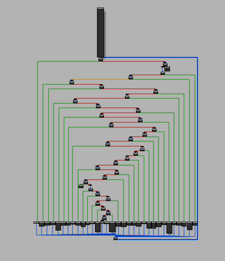

# MODeflattener
***Miasm's Ollvm Deflattener***  
> MODeflattener deobfuscates control flow flattened functions obfuscated by [OLLVM](https://github.com/obfuscator-llvm/obfuscator) using [Miasm](https://github.com/cea-sec/miasm).  
https://mrt4ntr4.github.io/MODeflattener/

I made some major changes to the logic employed by mrt4ntr4.
My version aims to support multiple state variables (but still breaks on some functions), it determines the state variable in use by checking which variable the next basic block compares with.
mrt4ntr4's function assumes that there is a separate basic block called the pre-dispatcher, which is between the relevant blocks and the dispatcher. In the binary I was analysing, this basic block is missing and the relevant blocks jump immediately to the dispatcher.
To overcome this problem, my version does not rely on finding the dispatcher, but instead just starts at the function start and adds each successor block to the todo-list.
For each block, the code checks what the state variable is (as described above) and checks if there are any writes to the state variable.
If there are writes, the next block should be looked up in the backbone.
If the state variable is not used, the next block should just be the one following it in the CFG.
I also changed the logic for detecting "useless instructions", namely the ones used for the CFF. mrt4ntr4's version does this by using a Def-Use graph. The problem with this that I encountered is that in many cases, the state variable is not actually used in the block, and therefore does not appear in the graph. To resolve this, I copied some functionality from Miasm's Def-Use graph to implement my own logic. I look at the last instruction in the ReachableDefinitions, and then follow the chain of instructions that influence the state variable.

I currently gave up on the project because I encountered many edge cases and it is taking me too much time at this point. In addition, due to al the edge cases and assumptions about the shape of the CFF, I cannot guarantee the correctness of the resulting output, which hinders analysis.

Flattened Flow             |  Deflattened Flow
:-------------------------:|:-------------------------:
  |  

## Installation
```
git clone https://github.com/mrT4ntr4/MODeflattener.git
cd MODeflattener
pip3 install -r requirements.txt
```

## Usage
```
└──╼ $python3 modeflattener.py -h
usage: modeflattener [-h] [-b BASEADDR] [-a] [-l LOG] filename patch_filename address

positional arguments:
  filename           file to deobfuscate
  patch_filename     deobfuscated file name
  address            obfuscated function address

optional arguments:
  -h, --help            show this help message and exit
  -b BASEADDR, --baseaddr BASEADDR
                        file base address
  -a, --all             find and deobfuscate all flattened functions recursively
  -l LOG, --log LOG     logging level (default=INFO)
```

## Supported Architectures
- *x86*

## Bonus
- [Tim Blazytko's flattening heuristic script](https://gist.github.com/mrphrazer/da32217f231e1dd842986f94aa6d9d37)  
  
  While disassembling the specified function we can look out for other functions used by it and can make use of this script to automatically detect whether it is a flattened one and try to deobfuscate it. This has already been integrated into the tool!    
- [nop-hider idapython script](https://gist.github.com/JusticeRage/795badf81fe59454963a06070d132b06)  
  
  This script hides the nop instructions from IDA graph view as the backbone is converted into a long nop chain after deobfuscation.  
- [qiling ida plugin](https://github.com/qilingframework/qiling/blob/master/qiling/extensions/idaplugin/qilingida.py)
  
  Obfuscation is a most common software protection technique to deliberately make the source or machine code hard to understand. Thanks to the IDA powerful CFG API, Qiling IDA plugin can implement multiple de-obfuscation techniques with a mixture of static and dynamic analysis.


## References
[Dissecting LLVM Obfuscator - RPISEC](https://rpis.ec/blog/dissection-llvm-obfuscator-p1/)  
[Automated Detection of Control-flow Flattening - Tim Blazytko](https://synthesis.to/2021/03/03/flattening_detection.html)  
